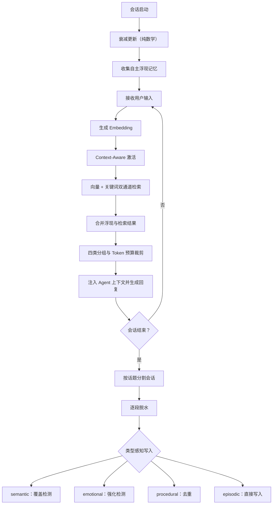

<div align="center">

# EngramTide

### AI Agent 的长期记忆层 —— 会遗忘，也会被一句话重新唤醒

[](https://www.python.org/)
[](https://modelcontextprotocol.io/)
[](LICENSE)

[30 秒看懂](#它解决什么问题) · [快速开始](#60-秒跑起来) · [接入方式](#接入方式) ·
[调参与调试](#它敢让你查也敢让你关) · [为什么这么设计](#为什么这么设计)

</div>

---

## 它解决什么问题

大多数 Agent 记忆方案是「只增不减的向量库 + top-k 检索」：**检索不到，就等于不存在。**

EngramTide 给记忆加了时间和状态。沉底的记忆不会被删，只是暂时排不进候选池；
当你说的话和它相关时，它会在**当轮**被拉回来。

下面是一轮对话里 `/debug activation` 和 `/debug retrieval` 的输出：

```text
👤 你: 我准备把上次那个爬虫重写一遍

📊 本会话累计激活: 强 1 / 轻 4 / 唤醒 1 / 抑制 2
  最近一轮明细:
    [strong|sim=0.61|w 0.08→0.28] 三月被反爬封了 IP，改用了 Playwright + 住宅代理

--- 最近一轮检索分数分解 ---
  [vec=0.61|kw=0.42|w=0.28|→0.155] [episodic] 三月被反爬封了 IP，改用了...
```

`w 0.08→0.28` 就是这件事的全部：这条记忆的权重已经衰减到 0.08，低于 0.1 的检索
门槛——上一轮它还是查不到的。你提了「爬虫」，它这一轮就回来了。

**不是搜索框，是真的会想起来。**

而且这一整套激活和衰减是**纯向量计算 + 纯数学，零 LLM 调用**。只有会话结束时的
话题分割与脱水才会花钱。接进你的 Agent 不会让每轮对话多几次 API 往返。

## 60 秒跑起来

```powershell
git clone -b perf/lightweight https://github.com/videcy/EngramTide.git
cd EngramTide
python -m venv .venv
.\.venv\Scripts\Activate.ps1
pip install -r requirements.txt
copy .env.example .env    # 填入 API Key
python main.py
```

需要 Python 3.10+、一个 DeepSeek Chat API，以及一个兼容 OpenAI `/v1/embeddings`
协议的 Embedding 服务：

```dotenv
DEEPSEEK_API_KEY=sk-your-actual-key

EMBEDDING_API_KEY=sk-your-embedding-key
EMBEDDING_BASE_URL=https://your-embedding-provider.example.com
EMBEDDING_MODEL=text-embedding-3-small
```

启动时会自动执行衰减更新并提取浮现记忆；活跃 episodic/emotional 超过 500 条时
会提示运行 `/consolidate preview`。

## 四类记忆

| 类型 | 装什么 | 生命周期 |
| --- | --- | --- |
| `semantic` | 用户事实、稳定知识 | 不衰减；新事实可覆盖旧事实 |
| `episodic` | 发生过的事件与经历 | 随时间衰减；可被相关语境重新激活 |
| `emotional` | 带有情绪效价与唤醒度的体验 | 高唤醒记忆衰减更慢；相似体验可强化 |
| `procedural` | 偏好、规则、做事方式 | 不衰减；写入时去重 |

事实、经历、情绪和习惯不该用同一套规则粗放管理——这是 EngramTide 所有机制的起点。
写入、衰减、激活、检索和合并策略都按类型分开执行。

## 它敢让你查，也敢让你关

记忆系统最大的信任问题是「它到底记住了什么、凭什么给我这条」。

| 命令 | 看到什么 |
| --- | --- |
| `/debug retrieval` | 最近一轮 Top-K 的分数分解 `[vec=\|kw=\|w=\|→]` |
| `/debug activation` | 本会话强/轻/唤醒/抑制统计与最近一轮明细 |
| `/debug decay` | 最近一次衰减摘要 |
| `/debug surface` | 当前自主浮现的记忆列表 |
| `/debug context` | Token 预算用量（估算/预算/收录/丢弃） |
| `/stats` | 记忆规模、类型分布、近 30 天净增长、DB 体积 |
| `/archive <关键词>` | 翻查已归档的记忆——**归档不是删除** |

每个机制都能单独关掉做对照实验，关闭后的行为逐条写明：

| 变量 | 默认 | 关闭后行为 |
| --- | --- | --- |
| `CONTEXT_AWARE_ENABLED` | true | 关闭逐轮语义激活 |
| `TOPIC_SPLIT_ENABLED` | true | 不分割话题，整段会话直接脱水 |
| `KEYWORD_CHANNEL_ENABLED` | true | 只使用向量相似度检索 |
| `MILD_ONCE_PER_SESSION` | true | 轻激活不设会话内次数上限 |
| `FTS_ENABLED` | true | 关键词通道回落到 rapidfuzz 全表模糊匹配 |
| `ARCHIVE_ENABLED` | true | 不做冷归档（记忆库恢复为只增不减） |
| `EPISODIC_DEDUP_ENABLED` | true | episodic 恢复无条件直写，不做近重复强化 |
| `DECAY_LOG_ENABLED` | **false** | 打开后记录每条记忆每次衰减（会显著增大 DB） |
| `ACCESS_LOG_ENABLED` | **false** | 打开后记录每次计访问事件（同上） |
| `CONSOLIDATE_AUTO_ENABLED` | **false** | 打开后退出时自动合并近重复（会发起 LLM 调用） |

出事能查，不好用能关。这是能接进生产的前提。

## 工作原理

### 一轮对话的完整闭环

```text
对话 → 话题分割与脱水 → 类型感知写入 → 衰减与自主浮现 → 逐轮情境激活
     → 向量/关键词双通道检索 → Token 预算截断 → 带记忆回复
```



### 激活与唤醒

- **逐轮激活引擎**：每轮用户输入后、检索之前，按余弦相似度对 episodic/emotional
  记忆做激活——强激活（sim > `SIMILARITY_HIGH`，+0.2 并计访问）/ 轻激活
  （sim > `SIMILARITY_MID`，+0.05 不计访问）。纯向量计算，零 LLM 调用。
- **休眠唤醒**：沉底记忆（decay_weight < 0.1，检索不到但未删除）被相关输入强激活后，
  当轮立即重回检索候选池。
- **可配置阈值**：默认 `SIMILARITY_MID=0.33`、`SIMILARITY_HIGH=0.56`，均可通过同名
  环境变量覆盖；`check_config()` 强制检查 `0 < MID < HIGH ≤ 1`。
  `scripts/calibrate_thresholds.py` 提供 P95/P25 重标定协议。
- **轻激活会话上限**：`MILD_ONCE_PER_SESSION`——同一会话内同一记忆至多轻激活 1 次
  （强激活不设限），抑制发生在截断之前，不占槽位。

### 检索与上下文

- **话题分割**：退出脱水前先调 LLM 按话题切分会话，每段独立脱水（embedding 语义更纯）；
  索引校验失败或 LLM 失败时整段回退，单段失败不牵连其余段（记忆零丢失）。
- **双通道检索**：`(0.7·向量 + 0.3·关键词) × decay_weight`，关键词通道兜住人名和
  专有名词。向量通道是一次归一化矩阵乘（激活与检索共用同一份相似度）；关键词通道走
  SQLite 内置 FTS5 倒排索引（`trigram` 分词，对中文有效），bm25 分在候选集内
  min-max 归一化到 [0, 1]。FTS5 不可用或查询项不足 3 字符时降级 rapidfuzz，
  再不可用则退化为纯向量。
- **Token 预算**：`MAX_CONTEXT_TOKENS=1500` 替代字符数近似——DeepSeek 系数保守
  估算器（宁高勿低），按条截断、procedural 保底、被丢弃的记忆不计访问。

### 记忆增长治理

- **冷归档**给「只增不减」的记忆库补上出口：沉底（`decay_weight` 触底）+ 从未被
  检索过（`access_count == 0`）+ 超过 `ARCHIVE_IDLE_DAYS` 无访问的 episodic 会移入
  `memories_archive`。**归档不是删除**：数据与向量都还在，`/archive <关键词>` 随时
  能翻出来，休眠唤醒机制不受影响。被真正用过的记忆永远不会被归档。
- **记忆合并**：`/consolidate` 手动触发——同类型、相似度 > 0.92 的近重复对由 LLM
  融合为一条，旧记忆 `superseded_by` 指向新记忆；`preview` 模式零成本预览。

## 接入方式

### Python API

除自带 CLI 外，EngramTide 提供本地 Python API。调用方在仓库根目录运行，或将仓库
根目录加入其 Python 环境后即可导入：

```python
from engramtide import EngramTide


async def run_conversation(agent, user_inputs: list[str]) -> list[str]:
    engine = EngramTide(db_path="data/memories.db")
    session = engine.start_session()
    responses = []

    for user_input in user_inputs:
        prepared = await session.prepare_turn(user_input)

        # 四类记忆片段，可按宿主 Agent 的 prompt 格式自行组装。
        sections = prepared.prompt_sections()
        response = await agent.generate(
            user_input=user_input,
            memory_context=sections,
        )

        # 只有真正交给 Agent 使用的记忆才计访问；同一 turn 重试不会重复计数。
        session.acknowledge_used(prepared.turn_id)
        session.add_message("assistant", response)
        responses.append(response)

    # 整段对话结束后统一提取并写入新记忆。
    await session.end()
    engine.close()
    return responses
```

| 接口 | 作用 |
| --- | --- |
| `EngramTide.start_session()` | 执行衰减并收集本会话的自主浮现候选 |
| `session.prepare_turn()` | 语义激活、检索并按 Token 预算生成四类记忆上下文 |
| `session.acknowledge_used()` | 对宿主实际采用的记忆计访问，支持幂等重试 |
| `session.add_message()` | 记录宿主 Agent 的回复，供会话结束时提取记忆 |
| `session.end()` | 话题分割、脱水并执行类型感知写入 |
| `list_memories()` / `get_memory()` | 查看当前记忆 |
| `export_memories()` | 导出不含 embedding 的 JSON-compatible 数据 |
| `delete_memories()` | 硬删除记忆及其访问/衰减日志 |
| `remember()` | 显式写入一条记忆，走类型感知写入管线 |
| `search_memories()` | 纯读检索：不激活、不计访问、不改权重 |

Python API 当前采用单进程、单 SQLite 数据库模型；不要在同一进程中并行创建指向不同
数据库的多个 `EngramTide` 实例。`prepare_turn()` 会记录用户消息，宿主生成回复后应
调用 `add_message("assistant", response)`。若宿主最终没有采用某些记忆，可以向
`acknowledge_used(turn_id, memory_ids=[...])` 只传实际使用的 ID。

### Claude Code：hook 注入 + MCP 写入

EngramTide 以单进程服务运行，同时提供两类接口，共用一个 SQLite 连接、一份向量缓存
和一份会话状态：

| 接口 | 端点 | 职责 |
| --- | --- | --- |
| HTTP hook | `/hooks/claude-code/*` | **读**：每轮自动注入记忆；记录对话原文 |
| MCP | `/mcp` | **写**：脱水、显式写入、合并、删除，以及只读的查询和统计 |

记忆注入不靠模型调用工具：Claude Code 每次提交 prompt 都会触发 `UserPromptSubmit`
hook，服务端完成激活、检索和预算截断后，以 `additionalContext` 返回。hook 从不写
记忆；记忆只在显式调用 MCP 工具时写入。

**1. 启动服务**

```powershell
python -m engramtide.mcp
```

**2. 注册 MCP（写入工具）**

```bash
claude mcp add --transport http engramtide http://127.0.0.1:8765/mcp
```

**3. 配置 hook**（`~/.claude/settings.json`）

```json
{
  "hooks": {
    "UserPromptSubmit": [
      { "hooks": [ { "type": "http", "url": "http://127.0.0.1:8765/hooks/claude-code/user-prompt-submit", "timeout": 10 } ] }
    ],
    "Stop": [
      { "hooks": [ { "type": "http", "url": "http://127.0.0.1:8765/hooks/claude-code/stop", "timeout": 5 } ] }
    ],
    "PostCompact": [
      { "hooks": [ { "type": "http", "url": "http://127.0.0.1:8765/hooks/claude-code/post-compact", "timeout": 5 } ] }
    ]
  }
}
```

三个 hook 各管一件事：

| hook | 做什么 |
| --- | --- |
| `UserPromptSubmit` | 记录用户输入；首个 prompt 时懒建会话（衰减 + 维护 + 浮现）；逐轮激活、检索并注入。注入的记忆当轮计访问 |
| `Stop` | 记录本轮助手的最终回复，供之后脱水 |
| `PostCompact` | 上下文压缩后，允许之前注入过的记忆再次注入 |

同一会话里已注入的记忆不会重复注入（它们还在上下文里）。斜杠命令和过短的输入只记录、
不注入。服务出故障时 hook 一律返回空响应，**不会阻塞或打扰用户的输入**。

不支持 `type: "http"` 的旧版 Claude Code 可改用 command hook，脚本只依赖标准库：

```json
{ "type": "command", "command": "python /path/to/EngramTide/scripts/claude_hook.py user-prompt-submit" }
```

`stop` 和 `post-compact` 同理。

**4. 写入记忆**

| 工具 | 作用 |
| --- | --- |
| `dehydrate` | 把对话原文中尚未处理的部分话题分割、脱水并写入。可重复调用，只处理新增轮次；`scope="pending"` 补扫所有会话；`dry_run` 只预览 |
| `remember` | 显式写一条记忆，覆盖/强化/去重规则照常生效 |
| `consolidate` | 合并近重复记忆，默认只预览 |
| `forget` | 不可恢复的硬删除，调用前应获得用户明确确认 |
| `restore_archived` / `run_maintenance` | 恢复归档记忆 / 立即执行维护 |
| `search_memories` | 显式查询，**纯读**：不激活、不计访问 |
| `list_memories` / `export_memories` / `memory_stats` / `search_archive` | 查看、导出、统计（含待脱水会话）、翻查归档 |

脱水只在调用 `dehydrate` 时发生。注入块 `<engramtide-memory session="…">` 携带当前
会话 ID，模型调用时直接使用。没来得及脱水的对话原文会一直保留在库里，之后随时可以用
`dehydrate(scope="pending")` 补上。

<details>
<summary>环境变量与网络安全说明</summary>

| 变量 | 默认值 | 说明 |
| --- | --- | --- |
| `ENGRAMTIDE_MCP_HOST` | `127.0.0.1` | 监听地址；可信局域网可改为 `0.0.0.0` |
| `ENGRAMTIDE_MCP_PORT` | `8765` | 监听端口 |
| `ENGRAMTIDE_MCP_PATH` | `/mcp` | Streamable HTTP 端点路径 |
| `ENGRAMTIDE_MCP_ALLOWED_HOSTS` | 本机 Host | 非本机监听时必填，多个值用逗号分隔 |
| `ENGRAMTIDE_MCP_ALLOWED_ORIGINS` | 本机 Origin | 浏览器客户端跨域访问时按需配置 |
| `ENGRAMTIDE_DB_PATH` | 继承 `MEMORY_DB_PATH` | 服务使用的 SQLite 文件 |
| `ENGRAMTIDE_SESSION_TTL_SECONDS` | `86400` | 空闲会话过期时间 |
| `ENGRAMTIDE_MAX_SESSIONS` | `32` | 同时保留的会话上限，超出时淘汰最久未用的 |
| `ENGRAMTIDE_HOOK_TOKEN` | 空 | 设置后 hook 请求必须带 `Authorization: Bearer <token>`（settings 中用 `headers` + `allowedEnvVars` 传入） |
| `HOOK_ENABLED` | `true` | 关闭后只记录对话原文、不注入 |
| `HOOK_DEDUP_INJECTED` | `true` | 关闭后每轮完整注入 |
| `HOOK_MIN_PROMPT_CHARS` | `4` | 更短的输入不注入 |
| `HOOK_MAX_CONTEXT_CHARS` | `9000` | 注入文本上限（Claude Code 上限 10000） |
| `HOOK_EMBED_TIMEOUT_SECONDS` | `4` | 超时即放弃本轮注入；须小于 hook 的 `timeout` |
| `HOOK_BUFFER_RETENTION_DAYS` | `7` | 已脱水对话原文的保留期；未脱水的永不自动清理 |

MCP 端点不提供 OAuth 或 Token 鉴权。默认仅绑定回环地址；只有在网络内所有设备均可信、
且有防火墙隔离时才应监听 `0.0.0.0`。此时必须将实际服务器地址（含端口）写入
`ENGRAMTIDE_MCP_ALLOWED_HOSTS`；浏览器型客户端还需配置 Origin。MCP 和 hook 端点都
启用官方 SDK 的 Host/Origin 校验。会话状态保存在进程内，服务重启后会在下一个 prompt
时自动重建；长期记忆和对话原文都在 SQLite 中，不受影响。**不要直接将该端口暴露到公网。**

对话原文（`conversation_turns` 表）是脱水的输入，含用户的完整对话内容。`memory_stats`
会显示其行数，脱水后按保留期清理。

</details>

## 对话命令

| 命令 | 说明 |
| --- | --- |
| `/exit` `/quit` | 结束会话，触发话题分割 + 脱水 + 写入管线，退出程序 |
| `/memories` | 打印数据库中最近 10 条记忆 |
| `/consolidate` | 合并近重复记忆（LLM 融合 + supersede 落库） |
| `/consolidate preview` | 预览合并候选对（零成本，不执行） |
| `/debug on` / `off` | 开关调试日志 |
| `/debug decay` `surface` `activation` `retrieval` `context` | 见[上文](#它敢让你查也敢让你关) |
| `/stats` | 记忆规模、按类型分布、近 30 天净增长、DB 体积 |
| `/maintenance` | 立即执行冷归档 + supersede 清理 + 埋点保留期清理 |
| `/archive <关键词>` | 翻查已归档的记忆（归档不是删除） |

## 为什么这么设计

EngramTide 并不试图复刻人脑，而是从认知科学中提取可以落地的软件机制。四个直接影响
了实现的结论：

- **记忆需要时间维度。** Ebbinghaus（1885）对保持与遗忘的定量研究，是 episodic 和
  emotional 会随时间衰减、而不是永久保持固定权重的依据。
- **语境可以唤醒记忆。** Collins & Loftus（1975）的
  [扩散激活理论](https://doi.org/10.1037/0033-295X.82.6.407)，被工程化为 embedding
  空间中的 Context-Aware 激活。
- **检索不到不等于消失。** Bjork & Bjork（1992）区分存储强度与提取强度，这是「沉底
  记忆保留而非删除、可在合适语境重新出现」的直接来源。
- **用过的记忆留得更久。** Roediger & Karpicke（2006）的
  [提取增强效应](https://doi.org/10.1111/j.1467-9280.2006.01693.x)，对应衰减公式里
  `1 + ln(1 + access_count)` 这一项。

再加上 Park et al.（2023）[Generative Agents](https://doi.org/10.1145/3586183.3606763)
的记忆流架构——EngramTide 在此基础上进一步区分「生成新的反思」与「重新浮现已有记忆」，
让重要经历能够主动进入当前上下文。

> 一句话：记忆不是静态资料，而是会遗忘、会因使用而改变，也会被当下语境重新唤醒的
> 动态状态。

## 附录

### 衰减与激活公式

| 类型 | 衰减率 | 说明 |
|------|--------|------|
| semantic | 0 | 永不衰减 |
| procedural | 0 | 永不衰减 |
| episodic | `0.05` | 标准艾宾浩斯 |
| emotional | `0.05 × (1 - arousal × 0.7)` | 唤醒度越高衰减越慢 |

```text
multiplier = exp(-rate × hours_elapsed / (24 × (1 + ln(1 + access_count))))
new_weight = max(0.01, old_weight × multiplier)
```

逐轮激活（衰减是乘法通道，激活是加法通道）：

```text
sim > SIMILARITY_HIGH                    → weight = min(1.0, weight + 0.2)，access_count + 1
SIMILARITY_MID < sim ≤ SIMILARITY_HIGH   → weight = min(1.0, weight + 0.05)，同会话每记忆至多 1 次
单轮激活上限 30 条（按相似度降序截断）
```

### 浮现规则

| 优先级 | 条件 | 阈值 |
|--------|------|------|
| R1 | procedural | 永远浮现 |
| R2 | emotional | `arousal > 0.7` 且 `decay_weight > 0.3` |
| R3 | unresolved | `decay_weight > 0.2` |
| R4 | episodic 近期 | `≤ 3 天` 且 `decay_weight > 0.5` |

超出上限（8 条）时按 R1 > R2 > R3 > R4 截断，同规则内按 decay_weight 降序。

### 项目结构

```text
EngramTide/
├── config.py              # 全部阈值、功能开关与服务配置
├── main.py                # CLI 主循环（衰减→浮现→逐轮激活→检索→上下文→写入）
├── engramtide/
│   ├── api.py             # EngramTide / EngramTideSession Facade
│   ├── service.py         # MemoryService：hook 注入读路径 + MCP 写路径
│   ├── hooks/             # Claude Code HTTP hook 路由（UserPromptSubmit / Stop / PostCompact）
│   └── mcp/               # Streamable HTTP 服务：MCP 工具 + 挂载 hook 路由
├── core/
│   ├── memory_store.py    # SQLite 存储层（CRUD + meta + FTS5 + 归档表）
│   ├── vector_index.py    # 进程内归一化向量矩阵缓存（一次矩阵乘算全量相似度）
│   ├── maintenance.py     # 冷归档 / supersede 清理 / 埋点保留期
│   ├── embedding.py       # Embedding API 客户端
│   ├── dehydrator.py      # 话题分割 + 分段脱水
│   ├── retriever.py       # 向量 + 关键词双通道检索
│   ├── context_builder.py # Constitutional AI 上下文 + Token 预算
│   ├── chat.py            # LLM 聊天调用
│   ├── decay.py           # 衰减引擎 + 浮现 + 逐轮激活
│   ├── memory_writer.py   # 类型感知写入管线
│   └── consolidator.py    # 记忆合并与去重
├── prompts/               # 交互宪法 / hook 注入模板 / 脱水 / 话题分割 / 记忆融合
├── utils/                 # 余弦相似度、UTC 时间工具、Token 保守估算器
├── scripts/
│   ├── rebuild_embeddings.py    # 改维度/换模型后的全库 embedding 重建
│   ├── calibrate_thresholds.py  # SIMILARITY_MID / HIGH 重标定（P95/P25 协议）
│   └── claude_hook.py           # 旧版 Claude Code 的 command hook 兜底（仅标准库）
├── tests/                 # 单元 + 集成测试（401 项）
└── data/                  # SQLite 数据库存放目录
```

### 技术栈

- **语言：** Python 3.10+
- **数据库：** SQLite（含 WAL 模式）
- **向量存储：** numpy float32 BLOB 存入 SQLite（入库即 L2 归一化，默认 512 维）
- **向量检索：** numpy 归一化矩阵乘暴力检索。**刻意不上 faiss / HNSW**——活跃记忆
  2 万条以内，暴力矩阵乘比 ANN 更快，且不需要额外索引内存、持久化与增删同步；
  越过 `ANN_BACKEND_THRESHOLD` 会提示改用 `sqlite-vec`
- **LLM：** DeepSeek（OpenAI-compatible 接口）
- **Embedding：** 独立 OpenAI-compatible `/v1/embeddings` provider
- **关键词索引：** SQLite 内置 FTS5（`trigram` 分词，零新依赖）；rapidfuzz 作二级降级
- **Agent 协议：** Claude Code HTTP hook（注入）+ MCP Streamable HTTP（写入，官方 Python SDK）

### 运行测试

```powershell
pytest -p asyncio -o asyncio_mode=auto
```

测试套件共 **401 项**，覆盖衰减数学、激活阈值边界、浮现筛选、写入管线、话题分割回退、
双通道打分、Token 预算截断、会话上限、合并候选与端到端、Python API、hook 注入
（去重/重放/fail-open/安全校验）与 Python API 路径的逐字段等价性、脱水增量与幂等、
MCP 工具发现契约、功能开关回退等价性和核心流程回归。其中包含严格的毫秒级性能
基准，结果会受到机器负载与硬件性能影响。

## 许可证

本项目基于 [MIT License](LICENSE) 开源。

---

<div align="center">

如果 EngramTide 对你有帮助，欢迎提出 Issue、提交 Pull Request，或给项目一个 Star。

</div>
